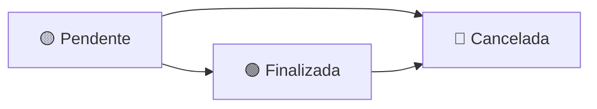

#  PerfumeStore API

<div align="center">


**Sistema completo de gerenciamento para loja de perfumes**

*Controle de estoque • Vendas • Clientes • Movimentações*

</div>

---

## 📋 Índice

- [📊 Visão Geral](#-visão-geral)
- [🏪 ProdutoService](#-produtoservice)
- [👥 ClienteService](#-clienteservice)
- [📦 EstoqueService](#-estoqueservice)
- [💰 VendaService](#-vendaservice)
- [🚀 Tecnologias](#-tecnologias)

---

## 📊 Visão Geral

A **PerfumeStore API** é um sistema robusto desenvolvido em .NET que oferece controle completo para lojas de perfumes, incluindo gestão de produtos, clientes, estoque e vendas com integração automática.

### ✨ Principais Features

- 🛡️ **Transações Seguras** - Todas as operações críticas são transacionais
- 📈 **Controle de Estoque** - Movimentações automáticas e rastreabilidade completa
- 💳 **Múltiplas Formas de Pagamento** - Dinheiro, cartão, PIX e crediário
- 📊 **Relatórios Avançados** - Consultas filtradas e dashboards
- 🔒 **Validações Rigorosas** - Regras de negócio implementadas em todos os níveis

---

## 🏪 ProdutoService

<details>
<summary><strong>📝 Regras de Negócio</strong></summary>

### ✅ Validações Principais
- 🚫 **Listagem Vazia**: Lança exceção se nenhum produto for encontrado
- 🔗 **Vinculação de Estoque**: Retorna EstoqueId associado se houver
- 💰 **Validação de Preços**: Preço de venda ≥ preço de compra
- 🔄 **Status Ativo**: Produto deve estar ativo para alterações
- ❌ **Exclusão Segura**: Verifica existência antes de excluir

### 💡 Funcionalidades
```
✓ CRUD completo de produtos
✓ Validação de preços automática
✓ Controle de status (ativo/inativo)
✓ Integração com sistema de estoque
```

</details>

---

## 👥 ClienteService

<details>
<summary><strong>📝 Regras de Negócio</strong></summary>

### ✅ Validações de Entrada
- 📄 **Paginação**: Página ≥ 1 e PageSize entre 1-100
- 🆔 **ID Válido**: ID do cliente > 0 nas buscas
- 📋 **CPF Único**: Validação de unicidade na criação e atualização
- 📅 **Data Automática**: Atribuição automática da data de cadastro

### 🛡️ Proteções de Integridade
- 🔒 **Desativação Controlada**: Cliente deve existir e estar ativo
- 🚫 **Exclusão Protegida**: Clientes com vendas não podem ser excluídos
- ♻️ **Uso de Desativação**: Sistema força desativação ao invés de exclusão

### 💡 Funcionalidades
```
✓ Paginação otimizada
✓ Validação completa de CPF
✓ Soft delete (desativação)
✓ Proteção contra perda de dados
```

</details>

---

## 📦 EstoqueService

<details>
<summary><strong>📝 Regras de Negócio</strong></summary>

### 🏗️ Gestão de Estoques
- 📛 **Nomes Únicos**: Não permite estoque com nome duplicado (case-insensitive)
- 📊 **Movimentação Automática**: Registra criação do estoque automaticamente
- ➕ **Quantidade Positiva**: Movimentações devem ser > 0

### 🔄 Movimentações
- ✅ **Validação de Existência**: Produto e estoque devem existir
- 🚪 **Controle de Entrada**: Vínculo apenas em Entrada/Devolução
- 🔒 **Estoque Único**: Bloqueia produto já vinculado a outro estoque
- 📉 **Saldo Positivo**: Impede quantidade negativa

### 📋 Histórico e Transferências
- 📈 **Rastreabilidade**: Histórico completo de movimentações
- 🔄 **Transferências Seguras**: Transações com origem/destino
- ⚠️ **Estoque Mínimo**: Alertas de quantidade baixa
- 🔍 **Filtros Avançados**: Por estoque, datas e produtos

### 💡 Funcionalidades
```
✓ Controle transacional completo
✓ Transferências entre estoques
✓ Alertas de estoque baixo
✓ Histórico detalhado de movimentações
✓ Soma automática de quantidades
```

</details>

---

## 💰 VendaService

<details>
<summary><strong>📝 Regras de Negócio</strong></summary>

### 🛒 Criação de Vendas
- 📦 **Itens Obrigatórios**: Venda deve conter ≥ 1 item
- 👤 **Cliente Ativo**: Cliente deve existir e estar ativo
- 📊 **Validação de Estoque**: Verifica disponibilidade antes da venda
- 🏷️ **Produtos Ativos**: Apenas produtos ativos podem ser vendidos
- 💵 **Preço Flexível**: Permite alterar preço no momento da venda
- ✅ **Valor Positivo**: Valor total > 0 após desconto
- 🔄 **Baixa Automática**: Reduz estoque ao criar venda (status Pendente)

### 💳 Finalização e Pagamento
- ⏳ **Status Pendente**: Apenas vendas pendentes podem ser finalizadas
- 💰 **Cobertura Total**: Pagamentos devem cobrir valor da venda
- 📅 **Vencimento Automático**: Crediário = 30 dias
- ✅ **Status Final**: Altera para "Finalizada" após pagamento
- 🔀 **Pagamento Misto**: Suporte a múltiplas formas

### ❌ Cancelamento Inteligente
- 🚫 **Proteção Dupla**: Vendas canceladas não podem ser re-canceladas
- 🔄 **Estorno Automático**: Devolve estoque se venda estava finalizada
- 🎯 **Localização Precisa**: Identifica estoque original pela movimentação
- 📝 **Histórico Completo**: Registra motivo do cancelamento

### 🏪 Formas de Pagamento
| Tipo | Descrição | Vencimento |
|------|-----------|------------|
| 💵 **Dinheiro** | Pagamento à vista | Imediato |
| 💳 **Cartão Crédito** | Pagamento eletrônico | Imediato |
| 💳 **Cartão Débito** | Pagamento eletrônico | Imediato |
| 📱 **PIX** | Transferência instantânea | Imediato |
| 📋 **Crediário** | Pagamento a prazo | 30 dias |

### 📊 Estados da Venda


- 🟡 **Pendente**: Criada, estoque baixado, aguardando pagamento
- 🟢 **Finalizada**: Pagamentos processados e validados
- 🔴 **Cancelada**: Cancelada, estoque estornado

### 📈 Relatórios e Consultas
- 🗓️ **Filtros Avançados**: Por período, status e cliente
- ⏳ **Vendas Pendentes**: Lista aguardando finalização
- ⚠️ **Vencimentos**: Crediário próximo do prazo
- 📋 **Visão Completa**: Cliente, itens e pagamentos

### 💡 Funcionalidades
```
✓ Fluxo completo de vendas
✓ Integração automática com estoque
✓ Múltiplas formas de pagamento
✓ Controle de vencimentos
✓ Estorno inteligente
✓ Rastreabilidade completa
✓ Relatórios avançados
```

</details>

---

## 🚀 Tecnologias

<div align="center">

| Tecnologia | Versão | Uso |
|------------|--------|-----|
|  | 8.0 | Framework principal |
|  | 12.0 | Linguagem |
|  | Latest | ORM |
|  | Latest | Mapeamento de objetos |
|  | 2019+ | Banco de dados |

</div>

---

<div align="center">

### 🌟 **Sistema em Produção**

**Desenvolvido com as melhores práticas de desenvolvimento**

*Padrões SOLID • Clean Architecture • Domain-Driven Design*

---

**⭐ Se este projeto foi útil, considere dar uma estrela!**

</div>
